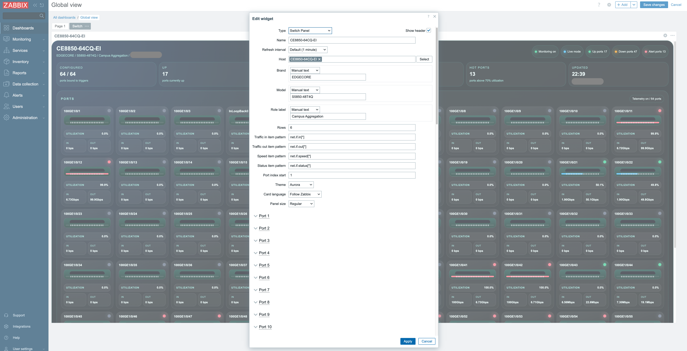

# Switch Panel Widget 中文说明

这是一个用于 Zabbix 7.x 的交换机面板小组件，用于展示端口状态、流量、速率和告警信息。

## 参考项目

本项目参考了以下开源项目的设计思路：

- [OpensourceICTSolutions/zabbix-widget-switch](https://github.com/OpensourceICTSolutions/zabbix-widget-switch)

当前仓库是在此基础上，结合实际使用场景做的定制化实现。

## 功能说明

- 自动发现交换机端口
- 根据行数自动布局端口
- 统计 `Up`、`Down`、`异常端口`
- 支持流量、速率、状态监控项模式配置
- 支持读取状态监控项的 value map 映射结果
- 支持按主机范围选择 Brand、Model、Role 对应 item
- 支持中英文卡片文案切换

## 界面截图

### 仪表板效果 - Aurora 主题

### 仪表板效果 - Ember 主题

### 编辑配置界面

## 安装方式

1. 将本目录复制到 Zabbix 模块目录，例如：`/usr/share/zabbix/modules/switchpanel`
2. 在 `Administration -> General -> Modules` 中启用模块
3. 在仪表板中添加 `Switch Panel` 小组件
4. 选择主机并配置以下参数：
   - `Rows`
   - `Traffic in item pattern`
   - `Traffic out item pattern`
   - `Speed item pattern`
   - `Status item pattern`

## 其他说明

- 插件作者：`canghai809`
- 当前版本：`0.0.1`
